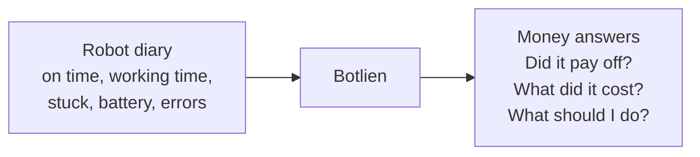

# Botlien: What Else We Can Put on the Dashboard

## Start here

A robot is like a delivery van you lease. Every month a bill shows up. The van either earns more than the bill, or it does not.

The problem is that almost nobody checks. When the deal was signed, a salesperson promised the robot would pay for itself in 14 months. After that, everyone got busy and nobody looked again.

Here is the useful part. Robots keep a diary. They write down when they turned on, when they were working, when they got stuck, and how much battery they burned. The technical word for that diary is telemetry.

Botlien reads the diary and turns it into money. That is the whole company in one sentence.

## What the dashboard shows today

Right now the board answers one question well: how did this month go?

**Coverage.** Did the robots do more work than they cost? 1.2x means they earned about 20 percent more than the bill. 0.8x means they lost money.

**Cost per job.** The monthly bill divided by how many jobs the robot finished.

**Same work by hand.** How many hours a person would have needed to do that same work.

**Which robots are weak.** Every robot in a list, best to worst.

**What to fix first.** Five tips, each with a dollar figure attached. For example, a robot that charges during the busiest hour of the day.

**Why the number moved.** If coverage went from 1.1x to 0.9x, this explains exactly which part caused it.

That is a solid report card for one month. But an owner has five bigger questions, and the board cannot answer a single one of them yet.

1. Did buying this robot actually work out?
2. What is this robot really costing me, all in?
3. Is the robot company keeping its promises?
4. What breaks next, and when?
5. So what should I actually do about it?

## A fact worth knowing before we start

I went through the database. There are four whole sets of information that we already collect, already save, and then never look at again.

We store where the robot was standing when it got stuck. Never used. We store how worn out the brushes and filters are. Never used. We store the loan terms. Never used. We store how often a human had to grab the controls. Never used in the money view.

It is like paying for a gym membership every month and never walking in. The best ideas below are just us finally walking in.

## How to read the tiers

The tiers are not about how good an idea is. They are about how hard it is to build.

**Tier 1 is food already in the fridge.** The robot writes it down, we already save it. We just have to cook it. We do not have to ask the customer anything.

**Tier 2 is one trip to the store.** We need one number from the customer, typed in once. Something like "what uptime did your contract promise you?"

**Tier 3 is a potluck.** It only works once other people show up. These ideas need data from other customers, so they come later by definition.

# Tier 1: already in the fridge

## 1. What the stuck robots really cost

**What the owner sees:** "Your team spent 31 hours this month unsticking robots and driving them by hand. At your $22 an hour, that is $682."

**Where it comes from:** We already count every time a robot gets stuck. We can measure how long each stall lasted. We already know when a human took the controls. And the owner already told us their hourly wage on the setup screen.

**Why it matters:** Everybody budgets the lease payment, because it arrives as a bill. Nobody budgets the babysitting, because it never arrives as anything. It is real money and it shows up on no invoice. The robot company has an obvious reason never to mention it.

## 2. Battery health

**What the owner sees:** "In June, this robot did 42 minutes of work per 1 percent of battery. In August it does 36. That is 14 percent worse in 60 days."

**Where it comes from:** We already save the highest and lowest battery reading each day, plus exactly how long the robot worked. Divide one by the other, then watch it over time.

**Why it matters:** The battery pack is usually the most expensive part on the machine. Batteries do not fail loudly. They fade. One day the robot just cannot finish a shift anymore, and by then it is an emergency instead of a plan. This gives the owner months of warning.

## 3. What it truly costs, all in

**What the owner sees:** "Your lease is $1,400 a month. Add electricity, worn parts, and the time your people spend helping the robot, and the real number is $1,790. Your true cost per job is 78 cents, not 61 cents."

**Where it comes from:** The bill we already have, plus charging time for the electricity, plus worn parts, plus idea number 1. We would ship average prices for electricity and parts so the owner does not have to look anything up, and let them correct it if they want.

**Why it matters:** It rewrites every number already on the board and makes them honest. The free calculators the robot companies hand out only ever divide by the lease payment. This is the grown up version.

## 4. The slow jobs

**What the owner sees:** "Half your jobs finish in 6 minutes. One in ten takes 19 minutes. Those slow ones cost you about 40 hours a month."

**Where it comes from:** Every job has an ID in the data we already store, so we can measure each one separately instead of only looking at the average.

**Why it matters:** Averages hide problems. The average is fine while one robot in the corner quietly takes three times as long as the rest. Warehouse people already think this way and already use these words, and 29 of our 47 target companies are warehouses.

## 5. The stuck map

**What the owner sees:** A map of their own floor, with hot spots where robots keep getting stuck, and a dollar amount on each spot.

**Where it comes from:** We save the robot's exact position every time we hear from it, and we have never once looked at it.

**Why it matters:** Honestly, this teaches the owner less than the others do. But it is the panel that makes someone lean toward the screen in a demo, and demos are the goal right now. We already detect the stuck spots. We just never drew the picture.

## 6. Brand against brand

**What the owner sees:** "Your six Pudu robots cost 58 cents per job. Your four Gausium robots cost 71 cents."

**Where it comes from:** We already store which brand each robot is, and we already work out cost per job for each robot. This is just grouping them.

**Why it matters:** This is the heart of the whole business. A robot company can only ever show you their own robots. They physically cannot compare themselves to a competitor, because they cannot see the competitor's machines. We can. And it works on day one, for any customer running two brands, with no other customers needed.

# Tier 2: one trip to the store

## 7. The payback tracker (my top pick)

**What the owner sees:** "You were told 14 months to pay this robot off. You are 12 months in and you have earned back 61 percent. At the speed your robots are actually running, you break even in month 19."

**What we have to ask:** What payback the salesperson promised, and when the contract started. Two boxes.

**Where the rest comes from:** Total work earned versus total money paid, added up from the start. Interesting detail: the database already has an empty table with columns for the loan amount, the start date, and the term. Somebody built it for exactly this and never filled it in.

**Why it matters:** Our own outreach email opens with the line "someone quoted you a payback number, has anyone checked it since?" Right now the product cannot answer the first question we ask. This closes that gap.

## 8. The broken promise ledger

**What the owner sees:** "Your contract promises the robots will be running 95 percent of the time. You got 91.2 percent. That gap is worth about $340 back to you. Here are the 14 times it was down, with dates and times."

**What we have to ask:** One number. The uptime the contract promised.

**Where the rest comes from:** We already measure exactly how long every robot was up.

**Why it matters:** This one pays for the subscription by itself. It is also impossible for a robot company to build, because it is a screen that hands their customer a bill. That makes it permanently ours.

## 9. Parts forecast

**What the owner sees:** "Brush is at 22 percent life. At the rate you are using it, it hits zero on October 14. That is $340. Your parts bill for the next 90 days is about $1,120."

**What we have to ask:** Nothing, if we ship average prices. Better if they tell us their real prices.

**Where the rest comes from:** The wear table we already fill in and never read.

**Why it matters:** It turns "the brush is getting worn" into a date and a dollar amount. Cleaning contractors live on this, and 8 of our targets are cleaning contractors.

## 10. Keep it, return it, or move it

**What the owner sees:** Their robots sorted into three piles. "Keep these four. Return these two when the lease ends in March. Move this one from Ontario to Fontana, it is worth about $210 more a month over there."

**What we have to ask:** When the leases end. Same question as the payback tracker.

**Where the rest comes from:** How each robot's coverage is trending, plus the comparison between sites we already calculate.

**Why it matters:** Everything else on the board is a number. This is advice. And "send this robot back" is advice the robot company is never allowed to give, which is the entire reason an independent tool gets to exist.

# Tier 3: the potluck

## 11. Comparing against everyone else

**What the owner sees:** "Your cost per job is 61 cents. Across every fleet we watch running this brand on this task, the middle is 44 cents. You are in the bottom third."

**What we need:** Other paying customers. The permission question is already in our signup flow.

**Why it matters:** This is the piece that gets stronger every time we sign a customer, and it can never be copied by a robot company, because they cannot see their competitors' machines.

My suggestion is to build the empty version now and show it locked. It costs an hour. Every person we demo to sees where this is going, so the demo sells the future instead of just this month.

# The whole thing on one page

| # | Idea | Tier | What we have to ask | Best thing about it |
|---|---|---|---|---|
| 1 | Cost of stuck robots | 1 | Nothing | Real money on no invoice |
| 2 | Battery health | 1 | Nothing | Months of warning on the priciest part |
| 3 | True all in cost | 1 | Nothing | Makes every other number honest |
| 4 | The slow jobs | 1 | Nothing | Speaks warehouse language |
| 5 | Stuck map | 1 | Nothing | Best panel in a live demo |
| 6 | Brand against brand | 1 | Nothing | A robot company can never build it |
| 7 | Payback tracker | 2 | Promised payback, start date | Answers our own opening line |
| 8 | Broken promise ledger | 2 | Promised uptime | Pays for the subscription |
| 9 | Parts forecast | 2 | Part prices, optional | Turns wear into a date |
| 10 | Keep, return, or move | 2 | Lease end dates | Advice, not just numbers |
| 11 | Compare to everyone | 3 | More customers | Gets stronger every sale |

# What I would build first

**The payback tracker,** because our outreach email asks that exact question and the product cannot currently answer it.

**The cost of stuck robots,** because it needs nothing from anybody, it is sitting in the database right now, and no competitor is counting it.

**Brand against brand,** because it proves the one thing we can do that no robot manufacturer will ever be able to do, and it works with a single customer.

Everything on this list fits the same rule the code already follows. We never claim a robot could do something. We only report what that robot already did.
